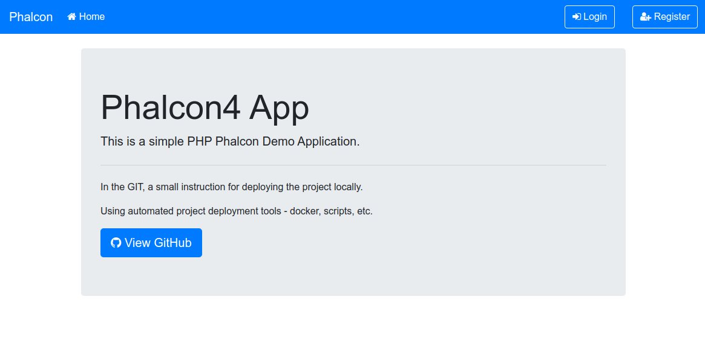
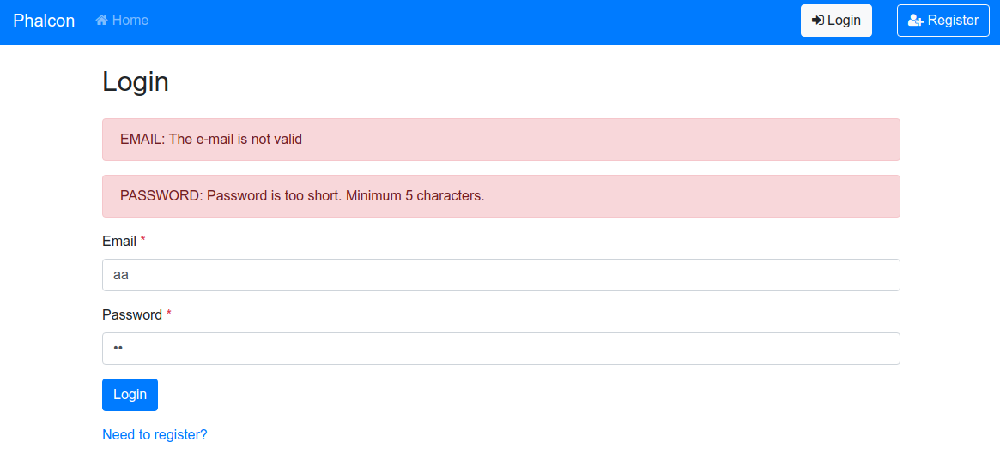
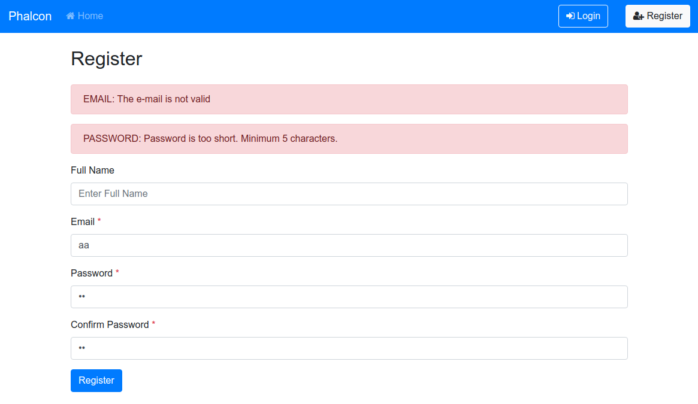
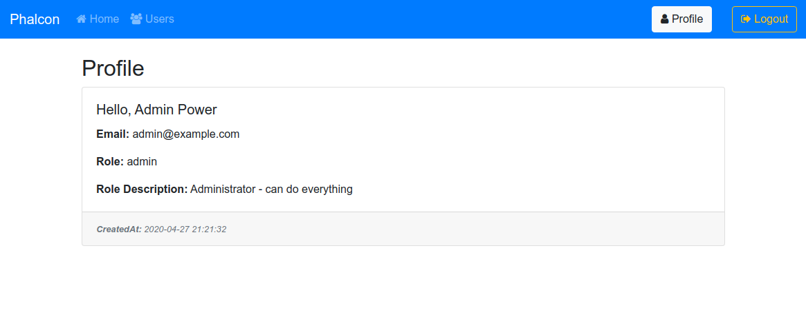

# Installation

### Setup
* Clone project
* Copy customizable configs .dist files `$ bash ./env/copyconf.sh`
 * In `docker-compose.yml` you can override your params: containers ports, DB user\passwords, etc.

### Build script
* `$ bash ./env/build.sh`
* This script include: 
    * build and up docker containers
    * composer install with "phalcon/devtools"

### Database
* Copy `dump.sql.gz` file into db container `$ docker cp env/dump.sql.gz mdev_mysql:/`
* Enter in db container `$ docker exec -it mdev_mysql bash`
* Import `dump.sql.gz` file `$ gunzip < dump.sql.gz | mysql -uroot -pphalcon phalcon_app`
* You can connect to db via cli `$ mysql -uroot -pphalcon`
* select DB `$ USE phalcon_app;`
* show tables `$ SHOW TABLES;`
* or using Adminer via `http://localhost:8088`

### PHP
* enter in workspace PHP container `$ docker exec -it mdev_php_fpm bash`
* run all necessary commands if need like `$ vendor/bin/phalcon`

### Accessing the application
* running in `http://localhost:8080`

### Accessing the Adminer to manage DB
* running in `http://localhost:8088`
* DB engine: `MySQL`
* DB server: `mdev_mysql`
* DB username: `root`
* DB password: `phalcon`
* DB name: `phalcon_app`

### Features list
* Phalcon Login, Logout, Profile with Session
    * Phalcon not found page error handler
* Password Hashing and Cross-Site Request Forgery (CSRF) protection
* Home, AllUsers, Login, Register Page Design
    * Create New Routes
    * Add Bootstrap 4.1
    * Add Font Awesome
* User Login
* User Registration
* Initializing Forms
* Request Environment (GET and POST Requests)
* Flashing Messages

# Demo users accounts
* admin@example.com / 12345
* user@example.com / 12345

### Screenshots

